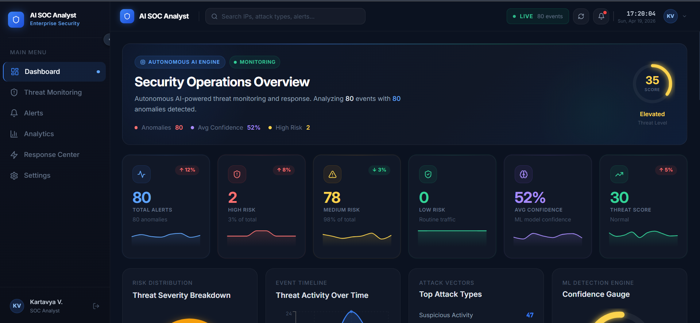

# 🛡️ AI SOC Analyst


Open-source autonomous AI Security Operations Center platform for anomaly detection, threat analysis, and automated incident response.
An autonomous AI-powered Security Operations Center (SOC) platform built to detect suspicious network behavior, analyze cyber threats, automate incident response, and provide live security visibility through a premium dashboard.

## Dashboard Preview



This project combines Machine Learning, LLM intelligence, automation workflows, and frontend monitoring into one modern cybersecurity system.

---

# 🚀 Key Features

## 🔍 AI + ML Threat Detection

* Detects suspicious traffic using Isolation Forest anomaly detection
* Feature-engineered detection pipeline using:

  * packet size
  * duration
  * protocol behavior
  * internal vs external traffic
  * long session indicators
  * large packet indicators

## 🧠 AI Threat Analysis

* Uses OpenAI to analyze serious anomalies
* Generates:

  * attack type
  * threat reasoning
  * severity level
  * recommended response actions

## 💰 Cost Optimized LLM Usage

* OpenAI is triggered only for high-confidence anomalies
* Low confidence alerts use local rule-based analysis
* Reduces API spend while keeping intelligence quality high

## ⚡ Automated Response

* Integrated with n8n workflows
* Sends Gmail alerts for critical incidents
* Supports future automation actions like ticketing / blocking IPs

## 📊 Premium SOC Dashboard

* Real-time alerts monitoring
* Confidence Gauge
* Risk distribution charts
* Threat timeline
* Attack type analytics
* Threat intelligence panels
* Live threat feed

## 🗄️ Alert Storage

* SQLite database stores:

  * source IP
  * destination IP
  * protocol
  * anomaly confidence
  * threat classification
  * response actions
  * timestamps

---

# 🧱 Tech Stack

## Backend

* FastAPI
* Python
* SQLAlchemy
* SQLite

## Machine Learning

* Scikit-learn
* Isolation Forest
* StandardScaler
* Feature Engineering

## AI Layer

* OpenAI API (`gpt-4.1-mini`)

## Automation

* n8n
* Gmail API

## Frontend

* React
* Vite
* Tailwind CSS
* Recharts
* Framer Motion
* Lucide Icons

---

# 🧠 Detection Workflow

```text
Incoming Log
→ Preprocessing
→ ML Anomaly Detection
→ Confidence Score
→ If High Confidence:
      OpenAI Threat Analysis
→ Save Alert
→ Trigger Automation
→ Display on Dashboard
```

---

# 📦 API Endpoints

## POST `/log`

Send network log for analysis.

### Example Request

```json
{
  "src_ip": "103.143.66.244",
  "dst_ip": "10.0.0.5",
  "protocol": "UDP",
  "packet_size": 6976,
  "duration": 22
}
```

### Example Response

```json
{
  "prediction": "anomaly",
  "confidence": 73,
  "analysis": {
    "attack_type": "UDP Flood",
    "reason": "Large UDP packets with extended duration indicate possible flooding behavior.",
    "risk": "High",
    "action": "Block source IP and monitor traffic."
  }
}
```

---

## GET `/alerts`

Returns stored alerts for dashboard.

---

# 💻 Run Locally

## Backend

```bash
git clone https://github.com/kartavya0203/Ai-socAnalyst.git
cd Ai-socAnalyst

python -m venv venv
venv\Scripts\activate

pip install -r requirements.txt

uvicorn app.main:app --reload
```

---

## Frontend

```bash
cd frontend

npm install
npm run dev
```

---

# 🔐 Environment Variables

Create `.env`

```env
OPENAI_API_KEY=your_openai_key_here
```

---

# 🧪 Testing

Includes traffic simulator for realistic SOC scenarios:

* Normal internal traffic
* Port scanning
* DDoS style traffic
* Large suspicious transfers
* Mixed anomaly bursts

---

# 📈 Current Version

## v1.5

### Completed

* ML anomaly engine upgraded
* Confidence scoring added
* Cost-optimized AI analysis
* Premium dashboard completed
* Database schema upgraded
* Real traffic testing completed

### Planned Next

* Threat Intelligence APIs (AbuseIPDB / VirusTotal)
* Live WebSocket alerts
* JWT Authentication
* Multi-user analyst roles
* MITRE ATT&CK mapping
* Deployment

---

# 🎯 Why This Project Matters

Security teams face alert fatigue and slow manual investigations.

AI SOC Analyst explores how autonomous systems can:

* reduce analyst workload
* prioritize threats
* automate response
* improve visibility
* scale security operations

---

# 👨‍💻 Author

Kartavya

---

# ⭐ If you like this project

Star the repo and connect with me.

---

# 📄 License

This project is licensed under the MIT License - see the [LICENSE](LICENSE) file for details.
